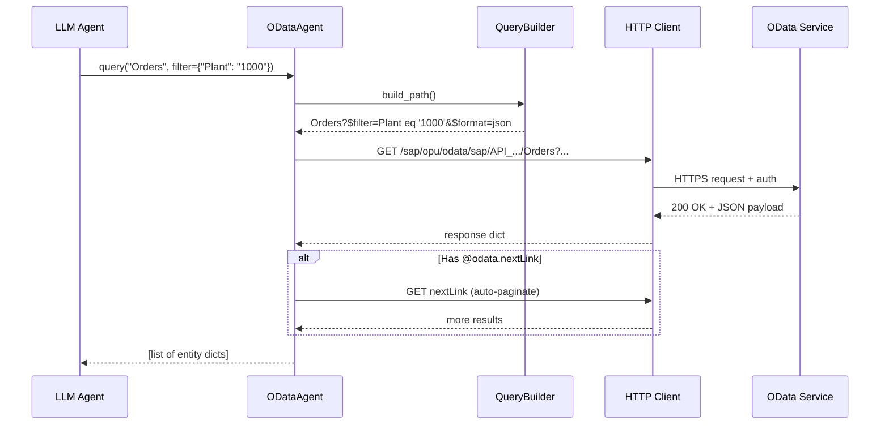
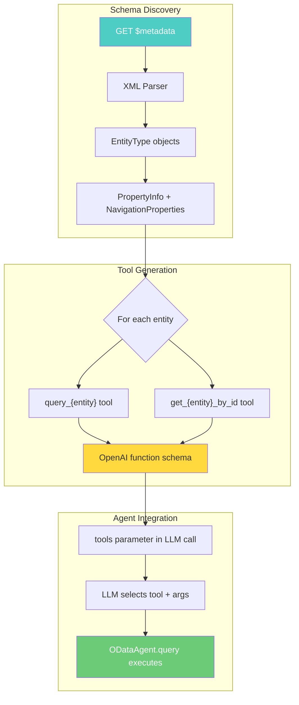
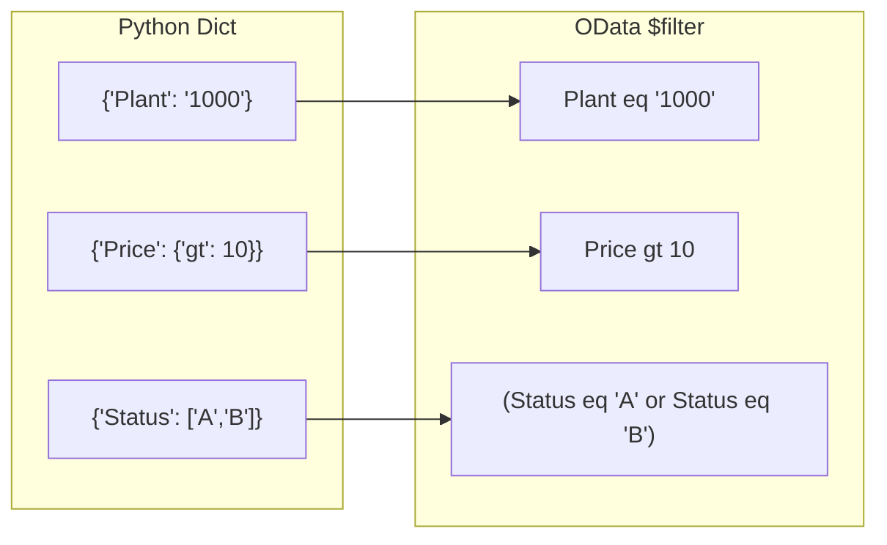
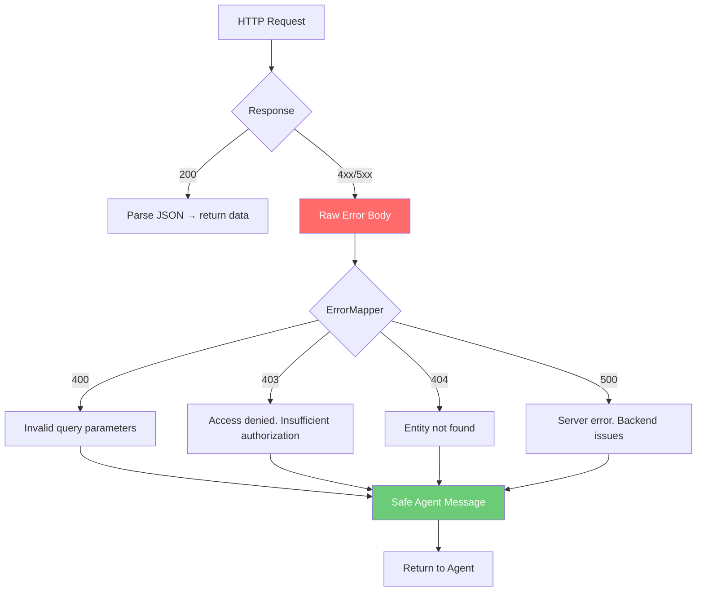
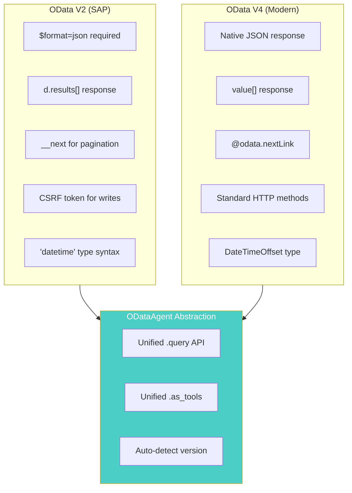

# ODataAgent Architecture

## Query Flow: User → OData Service

```mermaid
sequenceDiagram
    participant Agent as LLM Agent
    participant ODA as ODataAgent
    participant QB as QueryBuilder
    participant HTTP as HTTP Client
    participant SAP as OData Service

    Agent->>ODA: query("Orders", filter={"Plant": "1000"})
    ODA->>QB: build_path()
    QB-->>ODA: Orders?$filter=Plant eq '1000'&$format=json
    ODA->>HTTP: GET /sap/opu/odata/sap/API_.../Orders?...
    HTTP->>SAP: HTTPS request + auth
    SAP-->>HTTP: 200 OK + JSON payload
    HTTP-->>ODA: response dict
    
    alt Has @odata.nextLink
        ODA->>HTTP: GET nextLink (auto-paginate)
        HTTP-->>ODA: more results
    end
    
    ODA-->>Agent: [list of entity dicts]
```

## Tool Schema Generation

```mermaid
flowchart TD
    subgraph Discovery["Schema Discovery"]
        A[GET $metadata] --> B[XML Parser]
        B --> C[EntityType objects]
        C --> D[PropertyInfo + NavigationProperties]
    end

    subgraph Generation["Tool Generation"]
        D --> E{For each entity}
        E --> F["query_{entity} tool"]
        E --> G["get_{entity}_by_id tool"]
        F --> H[OpenAI function schema]
        G --> H
    end

    subgraph Binding["Agent Integration"]
        H --> I[tools parameter in LLM call]
        I --> J[LLM selects tool + args]
        J --> K[ODataAgent.query executes]
    end

    style A fill:#4ecdc4,color:#fff
    style H fill:#ffd93d,color:#333
    style K fill:#6bcb77,color:#fff
```

## $filter Construction

```mermaid
flowchart LR
    subgraph Input["Python Dict"]
        A["{'Plant': '1000'}"]
        B["{'Price': {'gt': 10}}"]
        C["{'Status': ['A','B']}"]
    end

    subgraph Output["OData $filter"]
        D["Plant eq '1000'"]
        E["Price gt 10"]
        F["(Status eq 'A' or Status eq 'B')"]
    end

    A --> D
    B --> E
    C --> F
```

## Error Handling Pipeline

```mermaid
flowchart TD
    REQ[HTTP Request] --> RES{Response}
    
    RES -->|200| OK[Parse JSON → return data]
    RES -->|4xx/5xx| ERR[Raw Error Body]
    
    ERR --> MAP{ErrorMapper}
    MAP -->|400| M1["Invalid query parameters"]
    MAP -->|403| M2["Access denied. Insufficient authorization"]
    MAP -->|404| M3["Entity not found"]
    MAP -->|500| M4["Server error. Backend issues"]
    
    M1 --> SAFE[Safe Agent Message]
    M2 --> SAFE
    M3 --> SAFE
    M4 --> SAFE
    
    SAFE --> AGENT[Return to Agent]

    style ERR fill:#ff6b6b,color:#fff
    style SAFE fill:#6bcb77,color:#fff
```

## V2 vs V4 Compatibility

```mermaid
flowchart TD
    subgraph V2["OData V2 (SAP)"]
        V2A["$format=json required"]
        V2B["d.results[] response"]
        V2C["__next for pagination"]
        V2D["CSRF token for writes"]
        V2E["'datetime' type syntax"]
    end

    subgraph V4["OData V4 (Modern)"]
        V4A["Native JSON response"]
        V4B["value[] response"]
        V4C["@odata.nextLink"]
        V4D["Standard HTTP methods"]
        V4E["DateTimeOffset type"]
    end

    subgraph ODataAgent["ODataAgent Abstraction"]
        UA[Unified .query API]
        UB[Unified .as_tools]
        UC[Auto-detect version]
    end

    V2 --> ODataAgent
    V4 --> ODataAgent

    style ODataAgent fill:#4ecdc4,color:#fff
```
